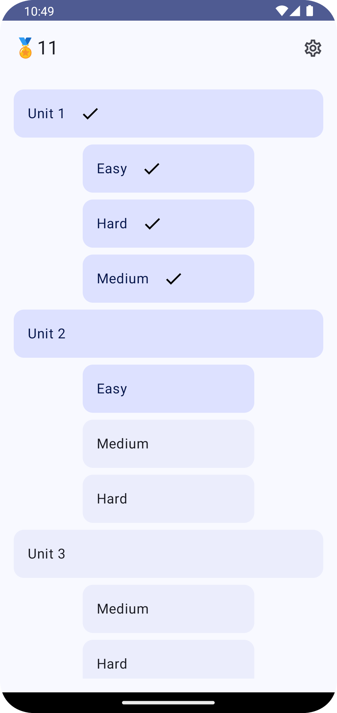
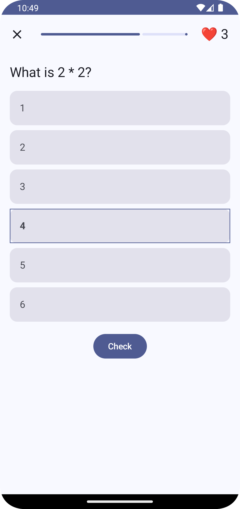
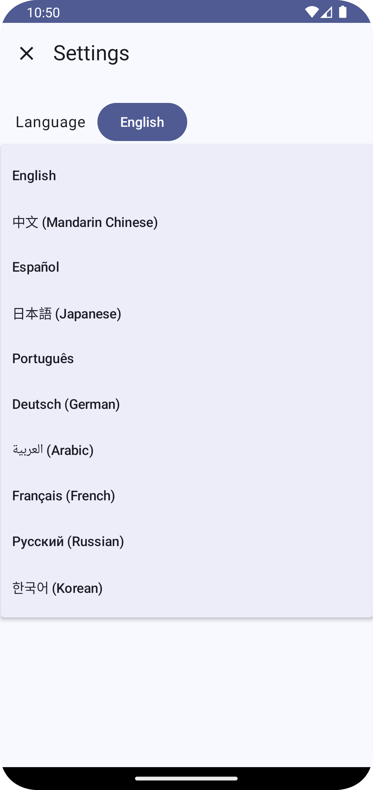

# Learn Trail

Education app that creates customizable learning paths for any subject. It integrates with any databases, offering sequential lessons and questions, user progress tracking, and gamification features to enhance the learning experience.

## Screenshots 📱
<p float="left">
  
  
  
</p>

##Features ✨
- Learning progression by sections
- Multilanguage powered by AI
- Offline first

## Built with 🛠️
- [Kotlin](https://kotlinlang.org/) - First-class and official programming language for Android development.
- Kotlin coroutines - Library for writing asynchronous code sequentially and concurrently.
- [Jetpack Compose](https://developer.android.com/jetpack/compose) - Android’s modern toolkit for building native UI.
- [Android Architecture Components](https://developer.android.com/topic/libraries/architecture) - Collection of libraries that help you design robust, testable, and maintainable apps.
- [Jetpack Compose Navigation](https://developer.android.com/jetpack/compose/navigation) - Navigation system for allowing users to navigate across different parts of your app.
- [Material 3](https://developer.android.com/reference/kotlin/androidx/compose/material3/package-summary.html) - Modular and customizable Material Design UI components for Android.
- [Firebase ML kit](https://firebase.google.com/docs/ml-kit) - Use machine learning in your apps to solve real-world problems.
- [Retrofit](https://square.github.io/retrofit/) - Type-safe HTTP client for Android and Java.
- [Moshi](https://github.com/square/moshi) - Modern JSON library for Android and Java, which makes it easy to parse JSON into Java/Kotlin objects.
- [Room](https://developer.android.com/jetpack/androidx/releases/room) - Persistence library providing an abstraction layer over SQLite to allow for more robust database access while harnessing the full power of SQLite.
- [Versions Catalog](https://docs.gradle.org/current/userguide/platforms.html#sub:version-catalog) - Centralized dependency version management to keep track of library versions in a single place.
- [JUnit](https://junit.org/junit5/) - Simple framework to write repeatable tests, used for unit testing in Android.
- [MockK](https://mockk.io/) - Mocking library for Kotlin.
- [Hilt](https://developer.android.com/training/dependency-injection/hilt-android) - Dependency injection library for Android that reduces the boilerplate of doing manual dependency injection in your project.  

## Contributing 🤝
We welcome contributions! Follow these steps to contribute:

### Getting started 🏁
1. Fork the repository.
2. Create a new branch (`git checkout -b feature/your-feature`).
3. Commit your changes (`git commit -m 'Add some feature'`).
4. Push to the branch (`git push origin feature/your-feature`).
5. Open a Pull Request.

### Installation ⚙️
1. Clone the repository:
   ```sh
   git clone https://github.com/wellingtonrib/LearnTrail.git
2. Open the project in Android Studio.
3. Sync the project with Gradle files.
4. Build and run the project on an Android device or emulator.

### Creating your own learning path 📚
1. Create your own remote datasource and adapters at data/datasources/remote
2. Change the RemoteDataSourceStrategy at di/DataModule to your created remote datasource

### Project TODOS ✅
https://github.com/users/wellingtonrib/projects/2

## Contact 📫
Developed by Wellington Ribeiro. If you have any questions or feedback, feel free to reach out at [wellington.rib@gmail.com](mailto:wellington.rib@gmail.com).

## Acknowledgements 🫡
Thanks to the open-source community for various libraries and tools used in this project.

## Support 🎗️
If you like this project, please give it a ⭐️! Contributions and suggestions are welcome.

## License 🔑
This project is licensed under the Creative Commons Attribution-NonCommercial 4.0 International Public License. You may share and adapt the material as long as you give appropriate credit, provide a link to the license, and indicate if changes were made. You may not use the material for commercial purposes.
For more details, please refer to the [LICENSE](LICENSE) file.

